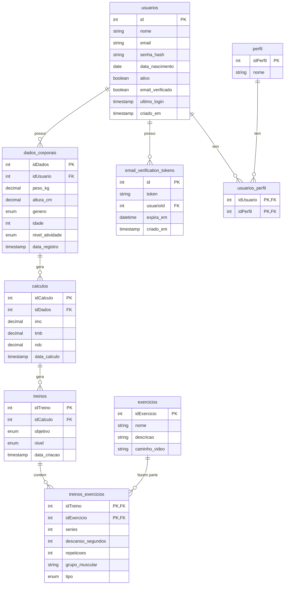

# Especificação Técnica e Arquitetura

Este documento consolida os artefatos técnicos do Sistema de Análise Corporal e Metabólica, definindo a estrutura de dados, componentes do sistema, relação de funcionalidades e os padrões visuais (Design System).

## 1. Diagrama Entidade-Relacionamento (DER)

Abaixo apresentamos o modelo conceitual e lógico de dados que sustenta o sistema.

## 2. Relacionamento: Funcionalidades, Dados e Lógica

A matriz abaixo detalha como os requisitos propostos se conectam à estrutura de banco e à lógica de programação.

| Funcionalidade | Tabelas/Entidades Envolvidas | Lógica de Negócio Envolvida |
| --- | --- | --- |
| **Cadastro e Login** | `usuarios`, `perfil`, `email_verification_tokens` | Hash de senhas (bcrypt), geração e validação de JWT, envio de e-mails para verificação de conta. |
| **Cálculo de IMC, TMB e NDC** | `dados_corporais`, `calculos` | Fórmulas matemáticas (ex: IMC = peso / altura²; TMB via equação de Harris-Benedict) multiplicadas pelo fator de atividade do usuário. |
| **Geração de Treinos Iniciais** | `treinos`, `treinos_exercicios`, `exercicios`, `calculos` | Algoritmo que lê o objetivo (hipertrofia, emagrecimento), nível e NDC do usuário e seleciona um subconjunto adequado de `exercicios` com séries/repetições predefinidas. |
| **Acompanhamento de Evolução** | `dados_corporais`, `calculos` | Consultas cronológicas (`ORDER BY data_registro DESC`) extraindo gráficos de evolução de Peso, IMC e NDC. |
| **Exibição de Exercícios** | `exercicios`, `treinos_exercicios` | Front-end renderiza a lista de exercícios do treino atual, carregando o campo `caminho_video` para um media player. |

