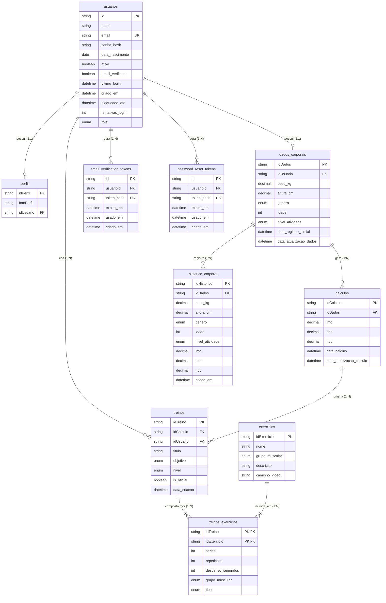

# Especificação Técnica e Arquitetura

Este documento consolida os artefatos técnicos do Sistema de Análise Corporal e Metabólica (IRONFIT), definindo a estrutura de dados, componentes do sistema, relação de funcionalidades, serviços de suporte e padrões visuais.

---

## 1. Diagrama Entidade-Relacionamento (DER)

O modelo foi evoluído para incluir `historico_corporal`, `password_reset_tokens` e `perfil` como entidades independentes.



---

## 2. Relacionamento: Funcionalidades, Dados e Lógica

A matriz abaixo detalha como os requisitos propostos se conectam à estrutura de banco e à lógica de programação.

| Funcionalidade | Tabelas/Entidades Envolvidas | Lógica de Negócio Envolvida |
| --- | --- | --- |
| **Cadastro e Login** | `usuarios`, `perfil`, `email_verification_tokens` | Hash de senhas (bcrypt), geração e validação de JWT, envio de e-mail de verificação via `emailService`. |
| **Recuperação de Senha** | `usuarios`, `password_reset_tokens` | Geração de token hash (SHA-256), validade de 1 hora, invalidação após uso. E-mail transacional enviado via `emailService`. |
| **Cálculo de IMC, TMB e NDC** | `dados_corporais`, `calculos` | Fórmulas matemáticas (IMC = peso / altura²; TMB via equação de Harris-Benedict) multiplicadas pelo fator de atividade do usuário. |
| **Geração de Treinos** | `treinos`, `treinos_exercicios`, `exercicios`, `calculos` | Algoritmo que lê o objetivo (hipertrofia, emagrecimento), nível e NDC do usuário e seleciona um subconjunto adequado de `exercicios` com séries/repetições predefinidas. |
| **Acompanhamento de Evolução** | `dados_corporais`, `calculos`, `historico_corporal` | Consultas cronológicas extraindo gráficos de evolução de Peso, IMC e NDC. Cada alteração de dados cria um snapshot em `historico_corporal`. |
| **Exibição de Exercícios** | `exercicios`, `treinos_exercicios` | Front-end renderiza a lista de exercícios do treino atual, carregando o campo `caminho_video` para um media player. |
| **Desativação de Conta** | `usuarios` | Soft-delete (`ativo = false`). Após desativação pelo próprio usuário ou por um ADMIN, o sistema envia e-mail de aviso via `enviarEmaildeContaDesativada()` preservando os dados históricos. |
| **Reativação de Conta (ADMIN)** | `usuarios` | ADMIN pode reativar contas desativadas via `PATCH /:id/reativar`. Após reativação, o sistema envia e-mail de boas-vindas via `enviarEmaildeContaReativada()`. Verifica se conta já está ativa antes de prosseguir. |
| **Gestão de Perfis (ADMIN)** | `usuarios` | ADMIN pode listar todos os usuários, alterar `role` (USER/ADMIN) e desativar contas de terceiros. Proteção IDOR aplicada para usuários comuns. |
| **Foto de Perfil** | `perfil` | Upload de imagem via Multer, salvo em `uploads/images/` e URL absoluta armazenada em `perfil.fotoPerfil`. |

---

## 3. Serviço de E-mail (`emailService.js`)

O sistema usa **Nodemailer** com SMTP do Gmail (porta 465, SSL). Todas as credenciais são lidas de variáveis de ambiente (`.env`).

| Função Exportada | Assunto do E-mail | Quando é Disparada |
| --- | --- | --- |
| `enviarEmailVerificacao(email, link)` | "Verifique sua conta - IRONFIT" | Após o cadastro do usuário, antes de ativar a conta. |
| `enviarEmailRecuperacaoSenha(email, link)` | "Recuperação de Senha - IRONFIT" | Quando o usuário solicita redefinição de senha. |
| `enviarEmaildeContaDesativada(email, nome)` | "Aviso de Desativação de Conta - IRONFIT" | Imediatamente após `desativarConta` (auto) ou `desativarUsuarioPorId` (ADMIN). |
| `enviarEmaildeContaReativada(email, nome)` | "Sua conta foi reativada - IRONFIT" | Imediatamente após `reativarUsuarioPorId` (ADMIN). Box verde de sucesso no template. |

> **Padrão visual dos e-mails:** fundo escuro (`#050505`), card com imagem de academia em overlay, logo IRONFIT em amarelo (`#ffe600`), botão CTA amarelo com sombra dourada. Templates HTML responsivos com media query para mobile (≤ 600px).

---

## 4. Arquitetura de Camadas (Backend)

```
producaoBack/src/
├── app.js                        ← Express, CORS, rotas globais
├── controllers/                  ← Orquestração de requests/responses
│   ├── authController.js         ← Registro, login, verificação, recuperação de senha
│   ├── usuariosController.js     ← CRUD de usuários, desativação, gestão de roles
│   ├── dadosCorporaisController.js
│   ├── evolucaoController.js
│   ├── exerciciosController.js
│   ├── treinoControllers.js
│   └── treinoExercicioController.js
├── repositories/                 ← Acesso a dados via Prisma ORM
├── services/
│   └── emailService.js           ← Templates e envio de e-mails transacionais
├── middlewares/
│   ├── autenticarToken.js        ← Validação JWT
│   └── tratarIdsCriptografados.js ← Proteção de IDs expostos na API
├── models/                       ← Classes de domínio (Usuario, DadosCorporais, etc.)
├── routes/                       ← Definição de rotas Express
├── config/                       ← Configuração do Prisma e banco
└── utils/                        ← Utilitários (hashing, tokens, etc.)
```

---

## 5. Variáveis de Ambiente Necessárias

| Variável | Descrição |
| --- | --- |
| `DATABASE_URL` | String de conexão MySQL para o Prisma |
| `JWT_SECRET` | Chave secreta para assinar tokens JWT |
| `EMAIL_USER` | E-mail Gmail usado como remetente (SMTP) |
| `EMAIL_PASS` | Senha de aplicativo do Gmail (App Password) |
| `FRONTEND_URL` | URL base do frontend (para links nos e-mails) |
| `PORT` | Porta do servidor Express (padrão: 3000) |

---

## 6. Mecanismos de Segurança Implementados

| Mecanismo | Onde é Aplicado |
| --- | --- |
| **bcrypt (hash de senha)** | `authController` — cadastro e verificação no login |
| **JWT (JSON Web Token)** | Gerado no login, validado em `autenticarToken.js` |
| **Proteção IDOR** | `usuariosController` — usuários comuns só acessam seus próprios dados |
| **Bloqueio por força bruta** | `usuarios.tentativas_login` + `usuarios.bloqueado_ate` |
| **Token hash (SHA-256)** | `email_verification_tokens` e `password_reset_tokens` |
| **Soft-delete** | Desativação de contas via `ativo = false` (dados históricos preservados) |
| **Role-based access** | ADMIN/USER controlado via `role` no JWT e verificação nos controllers |

