# Diagrama de Classes Utilizadas - IRONFIT

Este documento apresenta o modelo orientado a objetos do backend do sistema IRONFIT, representando as classes de domínio (`src/models/`), o serviço de e-mail (`src/services/`) e suas relações associativas.

---

## Representação Gráfica

```mermaid
classDiagram
    class Usuario {
        -String id
        -String nome
        -String email
        -String senha_hash
        -Date data_nascimento
        -Boolean ativo
        -Boolean email_verificado
        -Date ultimo_login
        -Date criado_em
        -Date bloqueado_ate
        -Number tentativas_login
        -String role
        +getId() String
        +getNome() String
        +getEmail() String
        +getSenha_hash() String
        +getData_nascimento() Date
        +isAtivo() Boolean
        +isEmail_verificado() Boolean
        +getUltimo_login() Date
        +getCriado_em() Date
        +getBloqueado_ate() Date
        +getTentativas_login() Number
        +getRole() String
        +setId(String id) void
        +setNome(String nome) void
        +setEmail(String email) void
        +setSenha_hash(String hash) void
        +setData_nascimento(Date data) void
        +setAtivo(Boolean ativo) void
        +setEmail_verificado(Boolean verificado) void
        +setUltimo_login(Date data) void
        +setBloqueado_ate(Date data) void
        +setTentativas_login(Number tentativas) void
        +setRole(String role) void
        +static criar(Object dados) Usuario
        +static editar(Object dados) Usuario
    }

    class DadosCorporais {
        -String idDados
        -String idUsuario
        -Number peso_kg
        -Number altura_cm
        -String genero
        -Number idade
        -String nivel_atividade
        -Date data_registro_Inicial
        -Date data_atualizacao_dados
        +getIdDados() String
        +getIdUsuario() String
        +getPeso_kg() Number
        +getAltura_cm() Number
        +getGenero() String
        +getIdade() Number
        +getNivel_atividade() String
        +getData_registro_Inicial() Date
        +getData_atualizacao_dados() Date
        +setIdDados(String idDados) void
        +setIdUsuario(String idUsuario) void
        +setPeso_kg(Number peso) void
        +setAltura_cm(Number altura) void
        +setGenero(String genero) void
        +setIdade(Number idade) void
        +setNivel_atividade(String nivel) void
        +static criar(Object dados) DadosCorporais
        +static editar(Object dados) DadosCorporais
    }

    class Calculo {
        -String idCalculo
        -String idDados
        -Number imc
        -Number tmb
        -Number ndc
        -Date data_calculo
        -Date data_atualizacao_calculo
        +getIdCalculo() String
        +getIdDados() String
        +getImc() Number
        +getTmb() Number
        +getNdc() Number
        +getData_calculo() Date
        +getData_atualizacao_calculo() Date
        +setIdCalculo(String idCalculo) void
        +setIdDados(String idDados) void
        +setImc(Number imc) void
        +setTmb(Number tmb) void
        +setNdc(Number ndc) void
        +static criar(Object dados) Calculo
        +static editar(Object dados) Calculo
    }

    class Treino {
        -String idTreino
        -String idCalculo
        -String idUsuario
        -String objetivo
        -String nivel
        -Boolean is_oficial
        -String titulo
        -Date data_criacao
        +getIdTreino() String
        +getIdCalculo() String
        +getIdUsuario() String
        +getObjetivo() String
        +getNivel() String
        +getIs_oficial() Boolean
        +getTitulo() String
        +getData_criacao() Date
        +setIdTreino(String idTreino) void
        +setIdCalculo(String idCalculo) void
        +setIdUsuario(String idUsuario) void
        +setObjetivo(String objetivo) void
        +setNivel(String nivel) void
        +setIs_oficial(Boolean oficial) void
        +setTitulo(String titulo) void
        +static criar(Object dados) Treino
        +static editar(Object dados) Treino
    }

    class Exercicio {
        -String idExercicio
        -String nome
        -String grupo_muscular
        -String descricao
        -String caminho_video
        +getIdExercicio() String
        +getNome() String
        +getGrupo_muscular() String
        +getDescricao() String
        +getCaminho_video() String
        +setIdExercicio(String idExercicio) void
        +setNome(String nome) void
        +setGrupo_muscular(String grupo) void
        +setDescricao(String descricao) void
        +setCaminho_video(String caminho) void
        +static criar(Object dados) Exercicio
        +static editar(Object dados) Exercicio
    }

    class EmailService {
        <<service>>
        -String smtpHost
        -Number smtpPort
        -String emailUser
        -String emailPass
        +enviarEmailVerificacao(String email, String link) Promise~void~
        +enviarEmailRecuperacaoSenha(String email, String link) Promise~void~
        +enviarEmaildeContaDesativada(String email, String nome) Promise~void~
    }

    Usuario "1" --> "1" DadosCorporais : possui dados corporais
    Usuario "1" --> "0..*" Treino : pode possuir treinos
    Usuario "1" ..> EmailService : notificado por
    DadosCorporais "1" --> "1..*" Calculo : gera cálculos metabólicos
    Calculo "1" --> "0..*" Treino : embasa treinos pessoais
    Treino "1" --> "1..*" Exercicio : associa exercícios
```

---

## Descrição das Classes

1. **`Usuario`**: Responsável pelas credenciais, perfil de acesso (ADMIN/USER), segurança contra força bruta (`tentativas_login`, `bloqueado_ate`) e status de verificação de conta.
2. **`DadosCorporais`**: Encapsula as medidas biométricas do atleta (peso, altura, idade, gênero e nível de atividade) com validações fisiológicas.
3. **`Calculo`**: Armazena as métricas metabólicas calculadas (Índice de Massa Corporal - IMC, Taxa Metabólica Basal - TMB e Necessidade Diária de Calorias - NDC).
4. **`Treino`**: Gerencia as fichas de treino, suportando tanto fichas personalizadas atreladas a um cálculo e usuário quanto fichas oficiais globais geradas por administradores (`is_oficial = true`).
5. **`Exercicio`**: Catálogo de exercícios físicos categorizados por `grupo_muscular` obrigatório (`Peito`, `Costa`, `Ombro`, etc.), links explicativos e descrições técnicas de execução.
6. **`EmailService`** *(Serviço)*: Responsável pelo envio de e-mails transacionais via Nodemailer/SMTP Gmail. Expõe três funções assíncronas para verificação de conta, recuperação de senha e notificação de desativação de conta. É invocado por `authController` e `usuariosController` de forma independente (falha no envio não impede a operação principal).

