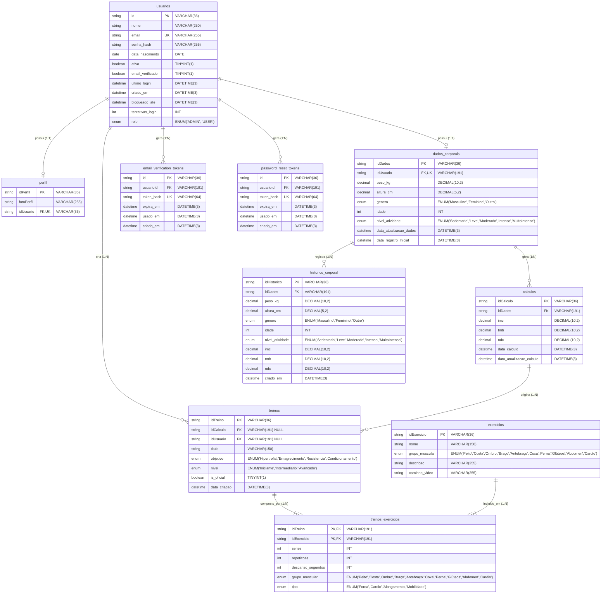

# Diagrama Entidade-Relacionamento (DER) - IRONFIT

Este documento contém o modelo conceitual e lógico de dados (DER) do banco de dados relacional `sistematmbndcimc`.

---

## Representação Gráfica

---

## Descrição das Tabelas e Cardinalidades

| Tabela Origem | Cardinalidade | Tabela Destino | Chave Estrangeira | Ação On Delete / On Update |
| :--- | :---: | :--- | :--- | :--- |
| `usuarios` | **1 : 1** | `perfil` | `perfil.idUsuario` -> `usuarios.id` | CASCADE / CASCADE |
| `usuarios` | **1 : 1** | `dados_corporais` | `dados_corporais.idUsuario` -> `usuarios.id` | CASCADE / CASCADE |
| `usuarios` | **1 : N** | `email_verification_tokens` | `email_verification_tokens.usuarioId` -> `usuarios.id` | CASCADE / CASCADE |
| `usuarios` | **1 : N** | `password_reset_tokens` | `password_reset_tokens.usuarioId` -> `usuarios.id` | CASCADE / CASCADE |
| `usuarios` | **1 : N** | `treinos` | `treinos.idUsuario` -> `usuarios.id` | CASCADE / CASCADE |
| `dados_corporais` | **1 : N** | `calculos` | `calculos.idDados` -> `dados_corporais.idDados` | CASCADE / CASCADE |
| `dados_corporais` | **1 : N** | `historico_corporal` | `historico_corporal.idDados` -> `dados_corporais.idDados` | CASCADE / CASCADE |
| `calculos` | **1 : N** | `treinos` | `treinos.idCalculo` -> `calculos.idCalculo` | CASCADE / CASCADE |
| `treinos` | **1 : N** | `treinos_exercicios` | `treinos_exercicios.idTreino` -> `treinos.idTreino` | CASCADE / CASCADE |
| `exercicios` | **1 : N** | `treinos_exercicios` | `treinos_exercicios.idExercicio` -> `exercicios.idExercicio` | CASCADE / CASCADE |
